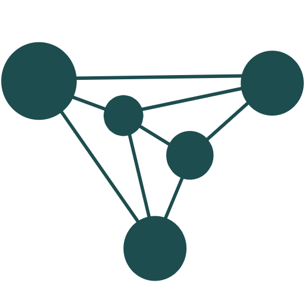

<p align="center">
  <a href="https://veza-app.herokuapp.com">
    
  </a>
</p>

<p align="center">
<a href="https://github.com/jonaspaq/veza"></a>
<a href="https://github.com/jonaspaq/veza"></a>
</p>

## About Veza

Veza is a web application that users can use to create accounts, add other users as friends, post a status, message other users and so much more

## Clone using git
```
git clone https://github.com/jonaspaq/veza.git
```

## Tools Used

- [Laravel Framework](https://laravel.com)
- [Docker](https://www.docker.com)
- [Laravel Echo]()
- [Pusher API](https://pusher.com)
- [VueJS](vuejs.org)
- [Vuex](http://vuex.vuejs.org)
- [Vue-router](https://router.vuejs.org)

## Date 

- Initial commit : October 5, 2019

## License

Veza is an open-source software licensed under the [MIT license](https://opensource.org/licenses/MIT).


